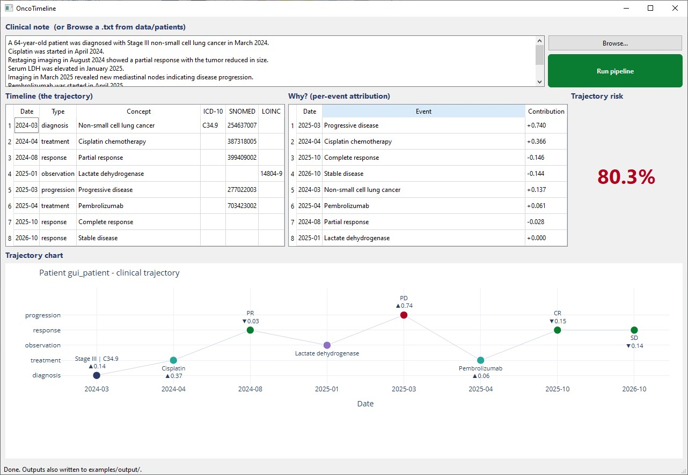
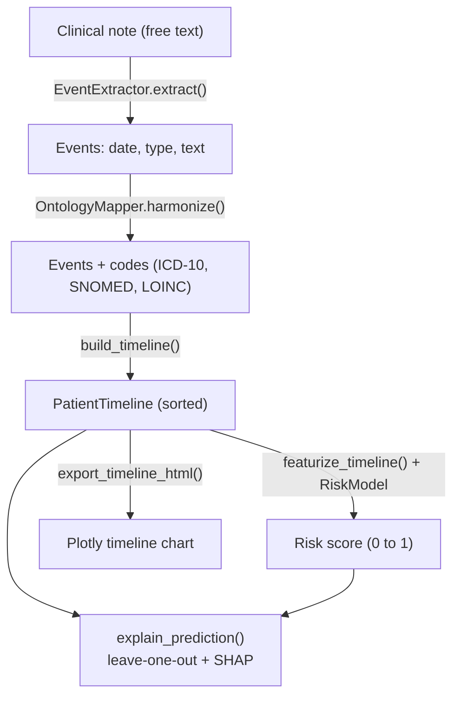

# OncoTimeline

OncoTimeline transforms heterogeneous oncology documentation (clinical free text)
into structured, time-aligned patient trajectories. It combines an LLM-based
extraction step, semantic harmonization to standardized vocabularies (SNOMED CT,
ICD-10, LOINC), a transformer-based temporal model of the trajectory and
treatment response, and interpretability that links the model's output back to
the source events. The whole pipeline runs locally.

In short, it is a small end-to-end demonstration of:

- extracting oncological events (diagnosis, staging, treatment, response, disease
  course, lab observations) from clinical free text with a local LLM,
- semantic harmonization to standardized vocabularies (SNOMED CT, ICD-10, LOINC),
- a transformer-based temporal model over the patient trajectory, and
- interpretability that attributes the model's output to the source events.

> [!WARNING]
>
> ## NOT FOR CLINICAL USE
>
> **This is an educational project. I built it to explore how hard it would be to
> put such a system together end to end, and to learn the methods involved.**
>
> **It is not a medical device, not validated, and must never be used for real
> clinical decisions. The temporal model is trained on synthetic data, and all
> the notes in this repository are made-up samples, not real patients. The code
> mappings (ICD-10, SNOMED CT, LOINC) are a small hand-written teaching subset,
> not a real terminology service.**

---

## What it does

A clinical note like this:

```
A 64-year-old patient was diagnosed with Stage III non-small cell lung cancer in March 2024.
Cisplatin was started in April 2024.
Restaging imaging in August 2024 showed a partial response with the tumor reduced in size.
Serum LDH was elevated in January 2025.
Imaging in March 2025 revealed new mediastinal nodes indicating disease progression.
Pembrolizumab was started in April 2025.
Restaging imaging in October 2025 showed a complete response with no evidence of disease.
A surveillance visit in October 2026 confirmed stable disease with no evidence of recurrence.
```

becomes a structured timeline with standard codes, a single risk score for the
trajectory, and a per-event explanation of that score.



In the run shown above (the first sample note, `data/patients/patient_001.txt`):

- Eight events are extracted across the full course: the Stage III diagnosis,
  first-line cisplatin, a partial response, an elevated LDH lab, a progression
  with new mediastinal nodes, second-line pembrolizumab, a complete response,
  and a later stable-disease check. The trajectory deteriorates and then
  recovers, which is visible as the markers move up and down between the lanes.
- Each event is mapped to standard codes: ICD-10 `C34.9` and SNOMED `254637007`
  for the diagnosis, SNOMED codes for the drugs, LOINC `14804-9` for the LDH lab,
  and SNOMED `277022003` for the progression.
- The predicted trajectory risk is about 80% (high). The progression is by far
  the largest driver (the big up arrow), while the partial, complete, and stable
  responses pull the score down (the down arrows). Note that the simple model
  weighs a progression heavily even though the patient later recovered, which is
  one of the limitations listed below. The risk is reproducible because the
  training seed is fixed.

The other four sample notes cover a treated locally advanced breast cancer
(low-moderate risk), a colorectal recurrence (high), a resected melanoma with a
durable response (low), and a prostate case with a rising PSA and progression
(high). The risk ordering matches what you would expect.

## What the "trajectory risk" is

Predicting risk from a patient's longitudinal trajectory is a real and active
research area. Transformer models trained on patient timelines are used to
predict concrete outcomes such as recurrence, progression, or survival. For
example, recent work has built transformer models that predict the risk of
early-stage lung-cancer recurrence from longitudinal clinical data, and others
that predict future health events directly from a tokenized patient timeline.

What does not exist is a single universal "trajectory risk" number. Real,
validated models predict a specific, well-defined endpoint (for instance,
recurrence within one year, progression-free survival, or mortality) and are
validated on large real cohorts.

In this project, the trajectory risk is a single illustrative score between 0
and 1, produced by a small Transformer trained on synthetic event sequences. It
is not tied to a specific clinical endpoint and is not validated. It exists to
show where a temporal model and its explanation would sit in the pipeline. Treat
it as a learning placeholder for the real, validated outcome model that a
production system would put in its place.

## How to run it

You need Python 3.10 or newer. There are two setups below. **Pick one and use
only that setup's commands.** Do not mix uv and pip in the same environment, or
packages can end up in the wrong Python.

### Setup A: uv (recommended)

[uv](https://github.com/astral-sh/uv) is a fast Python package manager. Inside a
uv environment, always use `uv pip` to install and `uv run` to run. Avoid a bare
`pip`, because a uv environment has no `pip` of its own and the command can fall
through to your system Python.

```
uv venv
# activate it (optional with uv, since "uv run" already uses .venv):
#   Windows:         .venv\Scripts\activate
#   macOS / Linux:   source .venv/bin/activate
uv pip install -e .
uv run python demo.py
```

Optional desktop app:

```
uv pip install -e ".[gui]"
uv run python -m onco_timeline.gui
```

Optional tests:

```
uv pip install -e ".[dev]"
uv run pytest
```

### Setup B: pip and venv

Use `python -m pip` (not a bare `pip`) so packages always go into the active
virtual environment.

```
python -m venv .venv
# activate it:
#   Windows:         .venv\Scripts\activate
#   macOS / Linux:   source .venv/bin/activate
python -m pip install -e .
python demo.py
```

Optional desktop app:

```
python -m pip install -e ".[gui]"
python -m onco_timeline.gui
```

Optional tests:

```
python -m pip install -e ".[dev]"
pytest
```

### What the run does, and the optional local LLM

`demo.py` trains the temporal model once on synthetic data, runs every sample
note, and writes the results (JSON, CSV, an interactive timeline, and an
explanation page) into `examples/output/`.

The desktop app shows the note on top with a Browse and a Run button. The Run
button also acts as a status light: grey while the model is preparing, green
when ready, amber while it is processing. Below it are the timeline, the
per-event explanation, the risk, and the chart.

By default the extractor uses simple rules, so nothing extra is needed. If you
want the LLM path instead, install [Ollama](https://ollama.com) and pull a model;
the extractor will then use it automatically, and nothing leaves your machine:

```
ollama pull llama3        # or gemma3, mistral
```

---

## How the pipeline works

A single note flows through these stages. Each module depends only on the shared
data model in `schema.py`, so a stage can be tested or replaced on its own.



1. **Load the note** (`note_loader.py`). Reads a `.txt` file from
   `data/patients/`. Plain Python.

2. **Extract oncological events from clinical free text** (`extraction.py`).
   Pulls out dated events: diagnoses, staging, treatments, disease course
   (response and progression), and lab observations. It tries a local LLM through
   Ollama first if one is reachable, and otherwise uses a deterministic rule
   parser (regular expressions for dates, keyword cues for the event type). Every
   result is validated against the schema with **Pydantic**, so a malformed model
   output becomes a clean error instead of a later crash.

3. **Semantic harmonization to standardized vocabularies** (`harmonization.py`).
   Maps each event's text to a canonical concept and attaches its standard codes
   (SNOMED CT, ICD-10, LOINC). Matching is restricted to the event's own category
   (a response only matches response concepts, and so on), and it tries an exact
   synonym match first, then falls back to **Sentence-BERT** embeddings
   (`sentence-transformers`, `all-MiniLM-L6-v2`) for paraphrases. Without the
   model it stays in synonym-only mode. Cross-institutional mapping is out of
   scope here (see the limitations).

4. **Build the timeline** (`timeline.py`). Sorts and de-duplicates the events
   into a `PatientTimeline`, can build a **NetworkX** graph of the sequence, and
   exports JSON and CSV (**pandas**).

5. **Transformer-based temporal model** (`temporal_model.py`). Turns the timeline
   into a feature table and runs a small **PyTorch** Transformer encoder
   (`nn.TransformerEncoder`) over the event sequence to represent the patient
   trajectory and treatment response and produce one risk score. It is trained on
   synthetic sequences generated from a known rule, so the method is real and
   runnable and the explanation has something genuine to work with.

6. **Interpretability and attribution to source events** (`explain.py`). Two
   views: a leave-one-out (occlusion) attribution that removes each event and
   measures how the risk changes, which links the model output back to the
   specific source events; and an optional **SHAP** view over a tabular summary
   of the trajectory (**scikit-learn** is used for a small surrogate).

7. **Visualize** (`report.py`, `gui.py`). A **Plotly** swimmer-style timeline and
   an optional **PySide6** desktop app.

---

## Methods and tools used

- Python 3.10+
- LLM-based information extraction with local models via Ollama (optional
  backend), with a deterministic rule parser as a fallback
- Pydantic (schema definition and validation of the extracted structure)
- Semantic harmonization to standardized vocabularies (SNOMED CT, ICD-10, LOINC)
  using Sentence-BERT sentence embeddings (`sentence-transformers`,
  `all-MiniLM-L6-v2`) with an exact-synonym pass
- Transformer-based temporal modeling of the patient trajectory and treatment
  response (PyTorch, `nn.TransformerEncoder`)
- Interpretability and attribution linking outputs to source events (leave-one-out
  occlusion, plus SHAP via scikit-learn)
- NumPy, pandas (data handling and exports)
- NetworkX (trajectory graph)
- Plotly (timeline visualization)
- PySide6 (optional desktop app)
- pytest (tests), uv (environment)

---

## Want to understand the logic first?

The `tutorial/` folder has two single-file scripts that walk through the exact
same pipeline with the simplest possible code. They are designed to be read top
to bottom, and they are for learning only, on sample data, with no clinical use.

- `tutorial/01_pipeline_rules_only.py`: the whole flow with plain rules and no
  dependencies.
- `tutorial/02_pipeline_with_models.py`: the same flow with the real
  Sentence-BERT and PyTorch models.

See `tutorial/README.md` for the suggested reading order.

---

## Honest limitations (and what a real version would change)

A few things are deliberately hard-coded to keep the project small and readable.
They are the main reasons this is a demonstration rather than a real system, and
each one points at what a production version would do instead. All of this is out
of scope for an educational project.

- **The concept and code registry** (`concepts.py`) is a small hand-written list.
  A real system would query a terminology service (UMLS, a SNOMED CT server, the
  official LOINC table, or an OMOP vocabulary) instead of a fixed table.
- **The response score** in the feature builder is set by hand (a complete
  response is good, progression is bad). A real version would learn this from
  labelled outcomes, or derive it from actual RECIST measurements.
- **The similarity threshold** for accepting an embedding match is a fixed
  number. It should be calibrated on validation data.
- **The risk model is trained on synthetic data** from a known rule. A real model
  would be trained on de-identified, labelled patient trajectories.
- **Date parsing** handles only a few common formats. A real system would use a
  dedicated clinical date/temporal extractor.
- **The rule-based extractor** uses simple keyword cues and exists as a fallback.
  A real system would rely on the LLM or a trained NER model.
- **The text and models are English.** For German notes (a common real case), a
  German clinical model such as medBERT.de would be swapped in.
- **It processes one note for one patient.** A real system would fuse multiple
  documents per patient and map across institutions.

---

## Sample data and disclaimer (again)

Every note in `data/patients/` is a made-up example written for this project.
There is no real patient data anywhere in this repository. Nothing here is
validated and nothing here should be used for clinical decisions. It is a
learning project.

## Author

Sasan Ardaneh

Portfolio (other projects): [sasanica.com](https://sasanica.com)

## License

MIT. See [LICENSE](LICENSE). The software is provided as is, without warranty of
any kind, and the author is not liable for any use of it.
